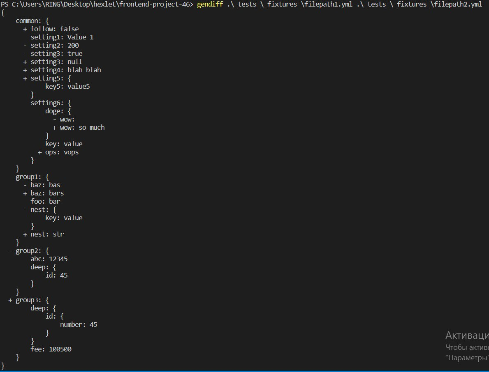
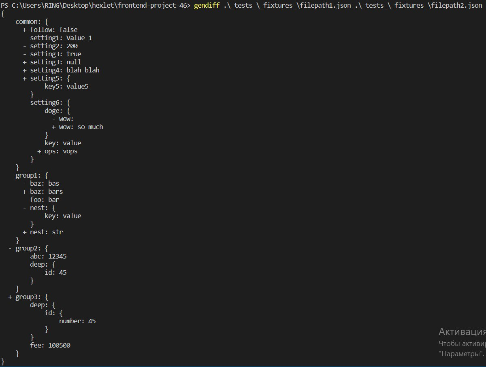
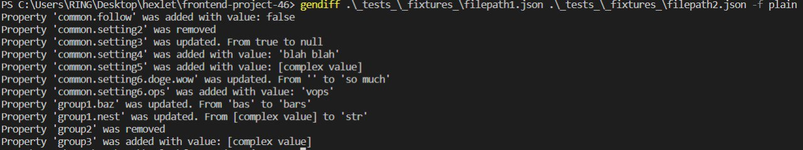
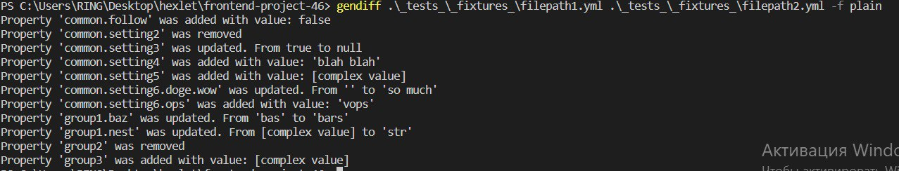
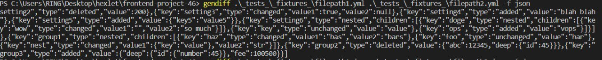
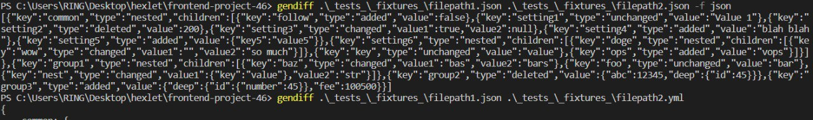

### Hexlet tests and linter status:
[](https://github.com/SpaYkeR696/frontend-project-46/actions)
[](https://codeclimate.com/github/SpaYkeR696/frontend-project-46/maintainability)
[](https://codeclimate.com/github/SpaYkeR696/frontend-project-46/test_coverage)

# ВЫЧЕСЛИТЕЛЬ ОТЛИЧИЙ (JavaScript)

Это пакет для расчета разницы между двумя конфигурационными файлами.

Файлы конфигурации могут иметь расширение «yml», «yaml» или «json».

Результат расчета может быть в трех различных форматах: «plain», «json» и «default».

Для запуска приложения Вам необходимо ввести
1. имя приложения (gendiff)
2. пути к файлам
3. результирующий формат

```
$ gendiff .\_tests_\_fixtures_\filepath1.json .\_tests_\_fixtures_\filepath2.yml
```

#### Примеры выполнения с разными форматами 











